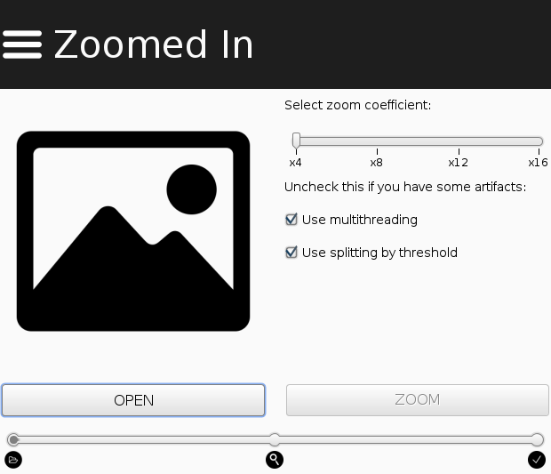
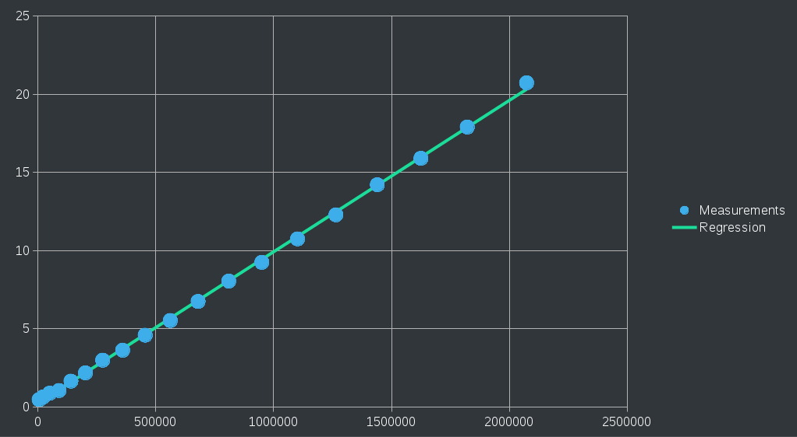

# Zoomed In

___
## About
This program can improve resolution of your images without loss of quality (almost). Simple and convenient GUI, several useful options will helps you in this.
___
## How to use it
1. [Download](https://github.com/constdigit/zoomed_in/raw/master/zoomed_in/out/artifacts/zoomed_in_jar/zoomed_in.jar)
2. [Run](http://www.wikihow.com/Run-a-.Jar-Java-File)
3. Open image from file or URL
4. Press "ZOOM" button
5. Save zoomed image
6. Done
___
## How it works
The image is represented as three arrays (red, green, blue) that contain the color values of each pixel. Elements of arrays are used as knots for constructing bicubic splines. After that, values of additional pixels are calculated. Resulting arrays transforms to image.

Multithreading allows program to use all available cores.

Splitting by threshold allows you to take into account contents of the image and use one function for interpolation on a monotone section. But this option is cause of slow working of program during processing big images.

___
## Complexity
Testing on quad-core processor with turned off "Splitting by threshold" option.

On x-axis - amount of pixels.

On y-axis - time in seconds.

___
## Conclusion
I just wanted to learn java.
